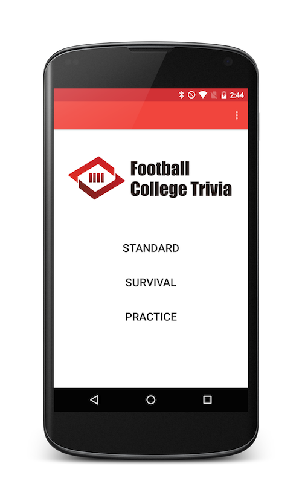
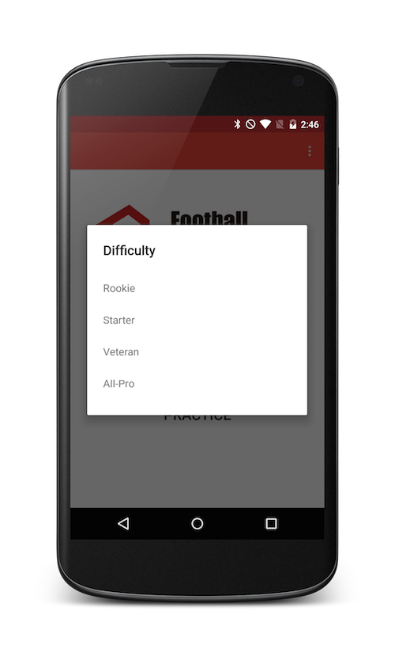
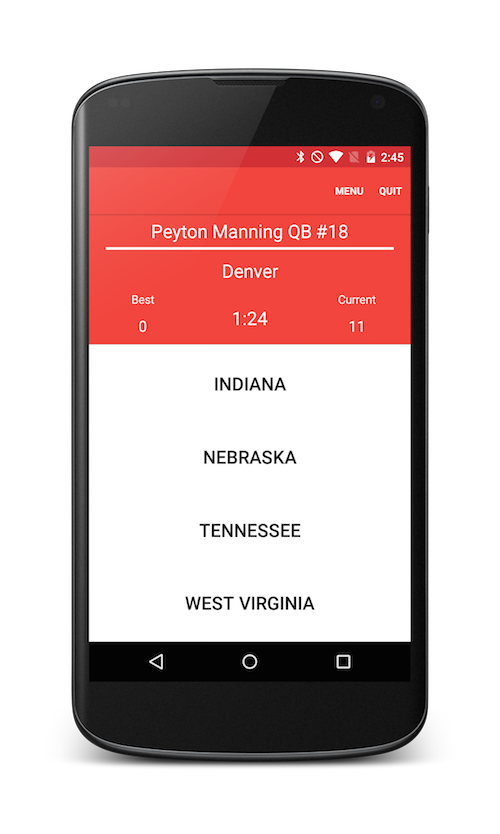

# Football College Trivia for Android

A football trivia game where the goal is to guess which college current NFL players attended.

Download
--------------

Pre-requisites
--------------

- Android SDK v23

Getting Started
---------------

This project uses the Gradle build system. To build this project, use the
"gradlew build" command or use "Import Project" in Android Studio.

Screenshots
-----------

License
---------------
This project is released under the MIT license. See LICENSE for details.
